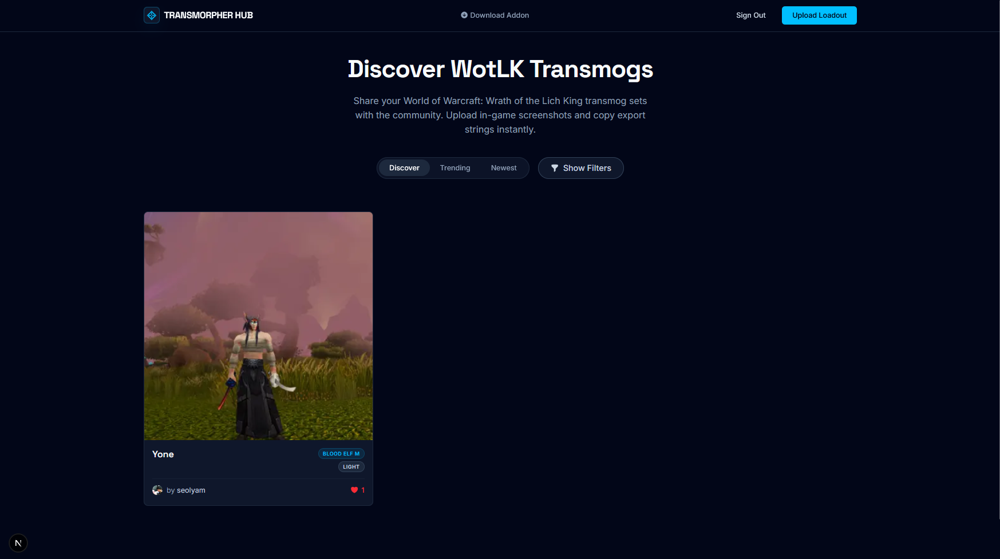
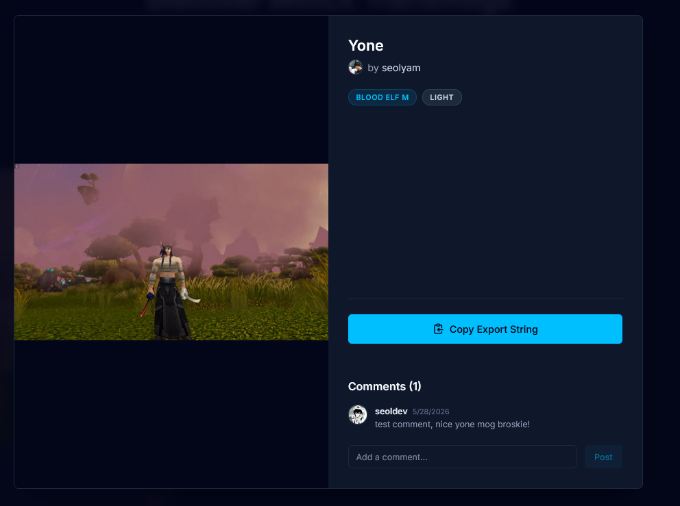

  
  
  # ⚔️ Transmorpher Hub

  **A community-driven web gallery for sharing World of Warcraft: Wrath of the Lich King (3.3.5a) transmog loadouts.**

  
  
  

---

## 📖 About
Transmorpher Hub is the official companion platform for the [Transmorpher Addon](https://github.com/Kirazul/Transmorpher) (a 3.3.5a WoW client addon). It allows players to discover, upload, and seamlessly share their custom transmogrification export strings with the community.

## ✨ Features

* **Seamless Integration:** Copy import strings from the web and paste them directly into your in-game Transmorpher addon.
* **Discover & Filter:** Sort the gallery by Trending or Newest. Filter loadouts by *Visual Weight*, *Race*, and *Gender*.
* **Social System:** 
  * Authenticate via **Discord** or **Google** OAuth.
  * Pick a unique username and retain your platform avatar.
  * ❤️ **Like** and **Comment** on community loadouts.
* **Manage Your Sets:** Upload your best in-game screenshots and easily delete your posts if you change your mind.

 

## 🔗 Links
- [Transmorpher Addon (GitHub)](https://github.com/Kirazul/Transmorpher)
- [Transmorpher Hub (GitHub)](https://github.com/seolyam/transmorpher-hub)

---

  <i>Built for the 3.3.5a HD Modding Community</i>

