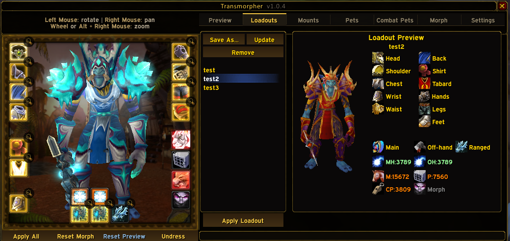

# Transmorpher

Transmorpher is a full client-side appearance and morphing suite for World of Warcraft: Wrath of the Lich King 3.3.5a.

It goes far beyond a basic transmog browser. The addon can preview and morph gear, race, creature displays, mounts, companion pets, hunter pets, enchants, titles, spell visuals, shapeshift forms, and selected world presentation settings from one UI, with optional peer-to-peer sync for other addon users.

## Highlights

- Full equipment transmogrification workflow with slot-based preview and direct apply.
- Creature and race morphing with saved favorites and direct display ID search.
- Mount, companion pet, and hunter pet morphing, including quick reset access.
- Enchant visual morphing for main-hand and off-hand weapons.
- Account-wide loadouts with talent spec bindings and auto-apply support.
- Form morph assignments for druid, shaman, warlock, priest, and DBW-style transformations.
- Direct spell morphing from your spellbook to other spell visuals.
- Search-heavy UI across items, sets, creatures, pets, titles, spells, and optimization lists.
- Optional world sync that shares visuals with other Transmorpher users without chat spam.
- Extra client-side controls for time, fog, far clip, render analysis, optimization, and HD font mode.

## What Transmorpher Covers

| Area | What you can do |
| --- | --- |
| Gear | Preview items by slot and armor/weapon subclass, apply hidden-slot looks, browse enchants, inspect item IDs, and open Wowhead links. |
| Sets | Browse item sets by class, preview full outfits, and inspect slot pieces around the dressing room model. |
| Character Morphs | Switch to race models, apply creature display IDs, resize your character, and save favorite morphs. |
| Mounts | Search by name, type, or display ID, apply a universal mount morph, hide the mount model, or reset it. |
| Pets | Search and morph companion pets with quick apply and reset support. |
| Combat Pets | Morph hunter pets from a curated family list or an all-creatures browser, or enter a display ID directly and scale the pet. |
| Enchants | Browse and apply main-hand and off-hand enchant visuals from the preview workflow. |
| Titles | Search and apply character titles from a dedicated picker. |
| Forms | Assign display IDs to supported form groups such as Bear, Cat, Moonkin, Tree, Travel, Aquatic, Flight, Ghost Wolf, Metamorphosis, Shadowform, and DBW forms. |
| Spell Visuals | Re-map spell visuals from your spellbook to other spell visuals and keep them persisted in character state. |
| World Presentation | Adjust time of day, fog, far clip, world render toggles, and selected debugging/analysis options. |
| Sync | Share your current state with other addon users through optional P2P world sync. |

## Tab Guide

### Main Tabs

| Tab | Purpose |
| --- | --- |
| `Preview` | Main browsing and preview hub for items, sets, forms, and spells. |
| `Loadouts` | Save, preview, overwrite, delete, and apply full appearance presets. |
| `Mounts` | Searchable mount morph browser with set, hide, and reset actions. |
| `Pets` | Searchable companion pet morph browser. |
| `CPets` | Hunter pet and creature-display browser with scaling support. |
| `Morph` | Race morph buttons, custom creature search, size controls, and favorites. |
| `Misc` | Environment, atmosphere, analysis, titles, HD font, and optimization controls. |
| `Settings` | Persistence, behavior, sync, interface toggles, and system status. |

### Preview Sub-Tabs

| Sub-Tab | Purpose |
| --- | --- |
| `Items` | Browse item appearances by slot and subclass, search by item name or ID, and preview them on the live model. |
| `Sets` | Browse class-filtered item sets, inspect each piece, and preview the full set. |
| `Forms` | Assign creature display IDs to supported shapeshift and transformation groups. |
| `Spells` | Pick a spell from your spellbook and assign it a different spell visual. |

### Misc Sub-Tabs

| Sub-Tab | Purpose |
| --- | --- |
| `Environment` | Set client-side world time. |
| `Atmosphere` | Control fog and far clip values. |
| `Analysis` | Toggle render and analysis flags such as terrain, M2, WMO, shadows, wireframe, normals, clutter, and related debug views. |
| `Titles` | Search and apply titles. |
| `HD Font` | Queue MSDF font rendering for the next client launch. |
| `Optimization` | Suppress spell visuals and sounds, protect important spell sets, and manage the protected spell list workflow. |

## Loadouts

Loadouts are one of the biggest features in the addon. A loadout can include:

- Equipment appearance and hidden-slot state.
- Weapon enchant visuals.
- Mount, companion pet, and combat pet morphs.
- Character morph and scale.
- Active title.

You can also:

- Preview a saved loadout before applying it.
- Overwrite an existing loadout.
- Delete old loadouts.
- Bind a loadout to Primary or Secondary talent spec.
- Auto-apply bound loadouts when you switch specs.

## Controls And Shortcuts

| Action | Result |
| --- | --- |
| Left-click an equipment slot | Select the slot and jump to matching item previews. |
| Alt + Left-click an item slot | Apply the currently previewed item morph to that slot. |
| Right-click an equipment slot | Remove or reset the slot morph. |
| Shift + Left-click an item slot | Print the item link and item ID to chat. |
| Ctrl + Left-click an item slot | Open a Wowhead URL dialog for the item. |
| Left-click an enchant slot | Enter enchant browsing mode in Preview. |
| Alt + Left-click an enchant slot | Apply the selected enchant visual. |
| Right-click an enchant slot | Remove the enchant morph. |
| Left-click a special slot under the model | Open the related tab quickly. |
| Right-click a special slot | Clear the current mount, pet, combat pet, or character morph. |
| Left-click minimap button | Toggle the main window. |
| Right-drag character info button | Reposition the character-frame launcher. |

## Slash Commands

| Command | Description |
| --- | --- |
| `/morph` | Toggle the Transmorpher window. |
| `/morph reset` | Reset all active morphs. |
| `/morph status` | Show DLL and current morph status. |
| `/morph morph <displayID>` | Morph your character to a creature or race display ID. |
| `/morph scale <value>` | Set character scale. Use `0` for default. |
| `/morph mount <displayID>` | Morph your mount. |
| `/morph pet <displayID>` | Morph your companion pet. |
| `/morph hpet <displayID>` | Morph your hunter pet. |
| `/morph enchant <mh|oh> <enchantID>` | Apply an enchant visual. |
| `/morph title <titleID>` | Apply a title. |
| `/morph sync` | Broadcast your current state to peers. |
| `/morph help` | Show command help. |

Aliases: `/vm` and `/Transmorpher`

## Multiplayer Sync

World sync is optional and can be toggled in `Settings`.

When enabled, Transmorpher can share your appearance state with other addon users nearby or connected through supported addon-message routes. The sync system is designed to be practical in real play:

- It discovers peers automatically.
- It re-broadcasts after state changes.
- It filters sync traffic out of visible chat.
- It handles large state payloads safely.
- It keeps your own morphs active even if you disable remote world sync.

This means sync is useful for shared social visuals, RP, events, or coordinated client-side appearance setups without polluting normal chat windows.

## Settings And Persistence

The addon supports both account-wide and per-character persistence.

### Account-level data

- Morph favorites.
- Global settings.
- Saved loadouts.

### Character-level data

- Current active morph state.
- Per-character settings.
- Mount, pet, and combat pet state.
- Form and spell morph assignments.

Key settings exposed in the UI include:

- Persist morphs across sessions.
- Save mount, pet, and combat pet morphs per character.
- Keep morphs in shapeshift forms.
- Show Warlock Metamorphosis instead of suppressing it.
- Enable or disable world sync.
- Show or hide the minimap button.
- Show or hide the character info button.
- Queue HD MSDF font mode for next launch.

## Installation

1. Copy the `Transmorpher` addon folder into your WoW addons directory:

   `World of Warcraft/Interface/AddOns/Transmorpher`

2. Place `dinput8.dll` in your WoW root directory, next to `Wow.exe`.

3. If you use Universal Proxy instead of the bundled DLL loader, configure that instead.

4. Launch the client and use `/morph` to open the UI or click on interface button.

## Summary

Transmorpher is not just a transmog browser. It is a unified visual control panel for WotLK 3.3.5a that combines appearance morphing, spell visuals, form overrides, loadouts, sync, and world-side client customization into a single addon workflow.
